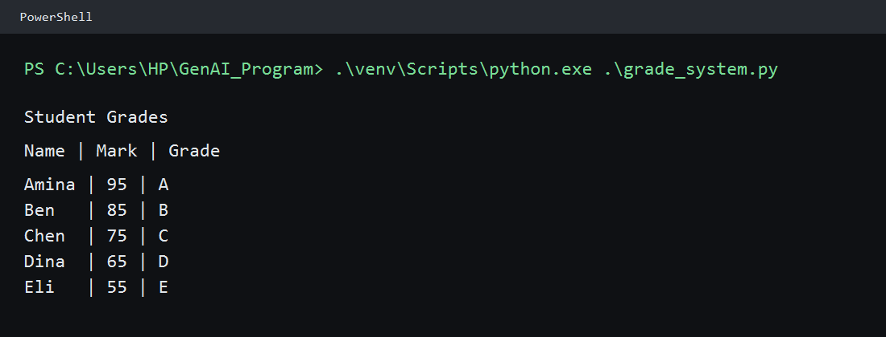

# Student Grade System

A small terminal program that asks for five student names and marks, then prints
each student's letter grade. It uses only Python's standard library and requires
no third-party packages.

## Run the program

From PowerShell in the project folder, create a virtual environment once:

```powershell
py -m venv venv
```

Run the program with the environment's Python executable:

```powershell
.\venv\Scripts\python.exe .\grade_system.py
```

Enter a name and a mark for each of the five students. Names cannot be blank;
marks must be numbers from 0 through 100. The program accepts decimal marks and
re-prompts after a blank name, nonnumeric mark, or mark outside the allowed
range. Grades come from the entered marks, so students in the same mark band
can receive the same grade.

## Python concepts used

- **Functions and return values:** `get_mark`, `get_grade`, and `main` divide the program into reusable steps.
- **Input and strings:** `input()` collects names and marks, while `.strip()` removes extra spaces.
- **Type conversion:** `float()` converts the mark text into a number.
- **Error handling:** `try` and `except ValueError` handle input that cannot be converted to a number.
- **Loops and decisions:** `for` processes five students; `while` repeats prompts; `if` and `elif` choose validation and grade outcomes.
- **Lists and tuples:** a list stores student records, with each record kept as a tuple of name, mark, and grade.
- **Formatted strings:** f-strings insert values into prompts and output; `:g` formats marks without an unnecessary `.0`.
- **Main guard:** `if __name__ == "__main__":` runs `main()` when this file is started directly.

## Grading scale

| Mark | Grade |
| --- | --- |
| 90-100 | A |
| 80-89 | B |
| 70-79 | C |
| 60-69 | D |
| Below 60 | E |

## Example run

